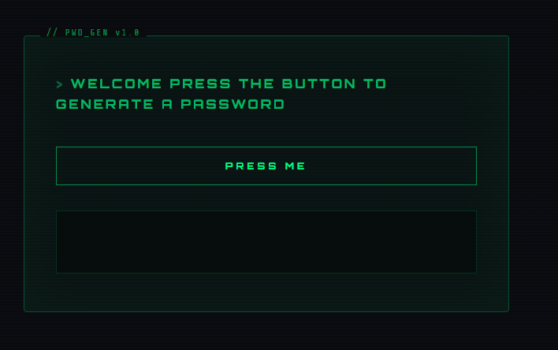

# Password Generator 🔐

A lightweight password generator that creates memorable yet secure passwords using randomised word combinations — no complex character strings to forget.

🔗 **Live Site:** [Password Generator](https://hybrid965.github.io/password-generator/)

---

## Screenshots



---

## How It Works

Rather than generating a random string of characters, this app combines four randomly selected words across different categories to produce passwords that are both strong and human-readable:

```
[Animal] + [Colour] + [Object] + [Symbol]
```

**Example output:** `WolverineCrimsonRocket$`

This approach is inspired by passphrase-style password theory — longer, word-based passwords are statistically harder to brute force than short complex strings, while being significantly easier to remember.

Each category contains 100+ words, giving a large pool of possible combinations.

---

## Features

- ⚡ One-click password generation
- 🧠 Memorable word-based pattern
- 🔣 Always includes a random symbol for complexity requirements
- 📋 Instant display with no page reload
- 🎲 Large word pools across animals, colours, and objects for high variability

---

## Tech Stack

- **HTML5** — Semantic structure
- **CSS3** — Styling and layout
- **JavaScript (ES6+)** — Random selection logic and DOM manipulation

---

## JavaScript Approach

Password generation uses `Math.random()` to independently select one entry from each of four arrays:

- `animals[]` — 100+ animal names
- `colors[]` — 70+ colour names including shades and gemstones
- `objects[]` — 80+ everyday objects
- `symbols[]` — 12 common special characters

A DOM reflow (`void password.offsetWidth`) is triggered before updating the text content to ensure CSS animations replay correctly on each generation.

---

## Running Locally

No dependencies or build tools required.

```bash
git clone https://github.com/Hybrid965/password-generator.git
cd password-generator
open index.html
```

Or open `index.html` directly in your browser.

---

## Future Improvements

- Copy to clipboard button
- Password strength indicator
- Option to regenerate individual segments
- Toggle to include/exclude numbers or symbols

---

## Author

**Will** — [GitHub](https://github.com/Hybrid965) | [Portfolio](https://hybrid965.github.io/portfolio)